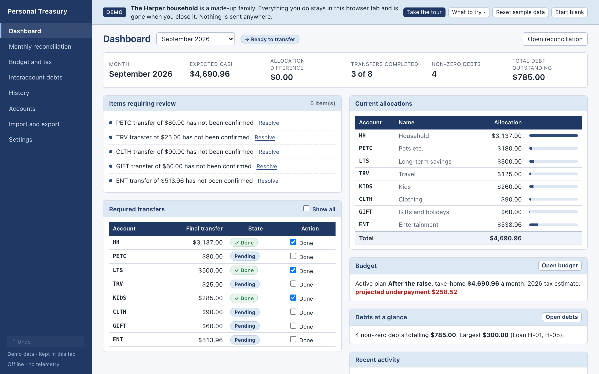
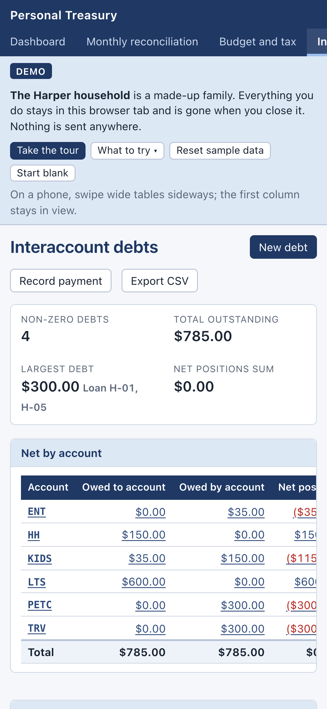

# Personal Treasury

By Orca Solutions.

A local-first desktop app for running a household's money as a set of **virtual account buckets**: plan how each paycheck is split, record transfers between buckets, reconcile every month to the cent, and keep an event-sourced ledger of what the buckets owe each other.

**[Try the live demo →](https://jfricano.github.io/personal-treasury/)** It runs entirely in your browser with sample data for a made-up family, starts with a one-minute guided tour, and includes a sample workbook to import. Nothing is sent anywhere, and your changes disappear when you close the tab.

**[Follow the one-minute walkthrough →](docs/guide/demo-walkthrough.md)** See how one paycheck becomes account allocations, monthly transfers, reconciliation and debt history.


## What it does

- **Budget → treasury.** A budget version turns gross pay, payroll deductions and actual withholding into take-home pay, then funds each account bucket from explicit budget lines. Versions lock once used, so history stays intact.
- **Monthly reconciliation.** Each month starts from the active budget. Transfers between buckets are journal entries, and every account's final transfer is `budget allocation + transfers in − transfers out`. The month is **Review**, **Ready to transfer** or **Complete**, and every failing check is named.
- **Interaccount debts.** When one bucket borrows from another, each Loan ID is a chronological event history. Balances are always recalculated, never typed in. The summary shows the latest non-zero balance per loan and reverses who-owes-whom when a loan is overpaid.
- **Tax estimate.** Federal, California, Social Security and Medicare estimates from editable, per-year rule tables, compared with what's actually withheld. It never changes take-home pay.
- **Excel in, Excel out.** Imports the spreadsheets it replaces, with a preview, control totals and cell-level warnings. It exports a normalized workbook and a complete JSON backup.
- **Traceable and reversible.** Every summary drills down to the entries behind it. Edits are audited and can be undone.

## Screenshots

<table>
  <tr>
    <td width="50%"></td>
    <td width="50%"></td>
  </tr>
  <tr>
    <td>Dashboard: expected cash, reconciliation, transfers and debts at a glance.</td>
    <td>A loan's full event history. Overpaying it reversed who owes whom.</td>
  </tr>
  <tr>
    <td></td>
    <td align="center"></td>
  </tr>
  <tr>
    <td>The guided tour walks through each screen on a first visit.</td>
    <td>On a phone, wide tables scroll inside their panels.</td>
  </tr>
</table>

## Privacy

The desktop app keeps its data in a SQLite file on your Mac. It has no accounts, no telemetry, no network calls and no cloud sync. The demo keeps its database in the browser tab's session storage. Money is stored as exact decimal strings and calculated with `decimal.js`, never binary floating point.

## Get started

```bash
npm install
npm run dev:demo      # the demo with sample data at http://localhost:1420
npm run tauri build   # the macOS desktop app (needs Rust)
```

Or run the demo container: `docker run --rm -p 8080:8080 ghcr.io/jfricano/personal-treasury-demo`, then open http://localhost:8080.

[Getting started](docs/guide/getting-started.md) walks through running, building and setting up your household.

## Documentation

- **Using it:** [Getting started](docs/guide/getting-started.md) and the [user guide](docs/guide/user-guide.md), which uses the demo household as its example.
- **Sharing it:** [Distribution plan](docs/distribution-plan.md) and the [demo walkthrough](docs/guide/demo-walkthrough.md).
- **Building it:** [Development](docs/development/development.md), [architecture](docs/development/architecture.md), the [calculation rules](docs/development/data-and-rules.md), [workbook import](docs/development/workbook-import.md), [acceptance tests](docs/development/acceptance-tests.md), [testing](docs/development/testing.md) and [decisions](docs/development/decisions/).

[docs/README.md](docs/README.md) lists every document and what it's for.

Stack: Tauri 2, React 19, TypeScript, SQLite (sql.js), decimal.js, Zod, SheetJS, Vitest and Playwright. The app replaces a spreadsheet system and preserves its rules exactly. The owner's own workbooks, and the tests that check the app against them, stay private (see [reference/README.md](reference/README.md)); the public tests use synthetic workbooks and the demo's fictional household.

## License

[MIT](LICENSE)
