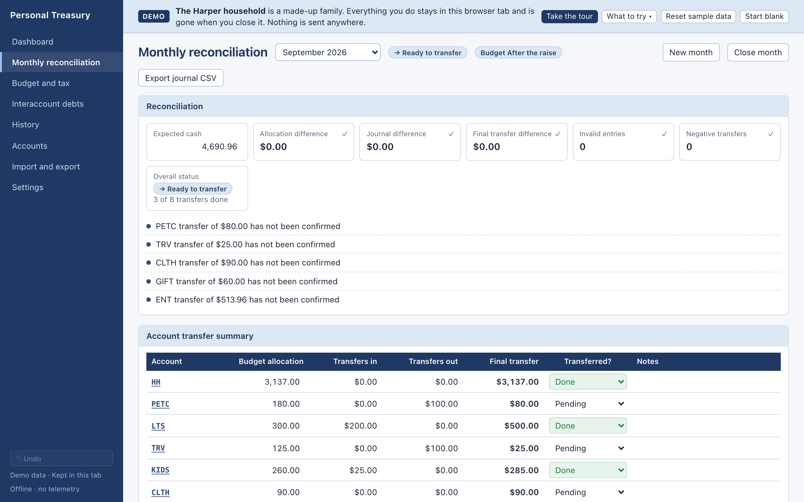
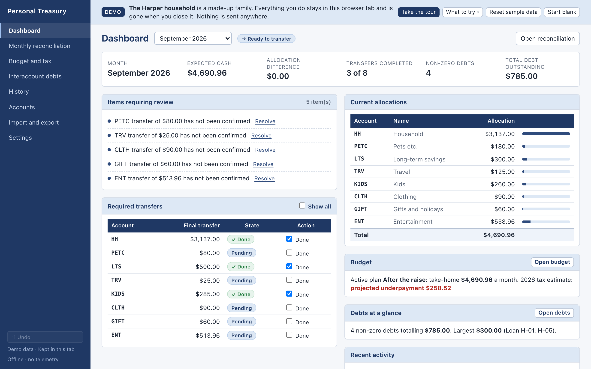
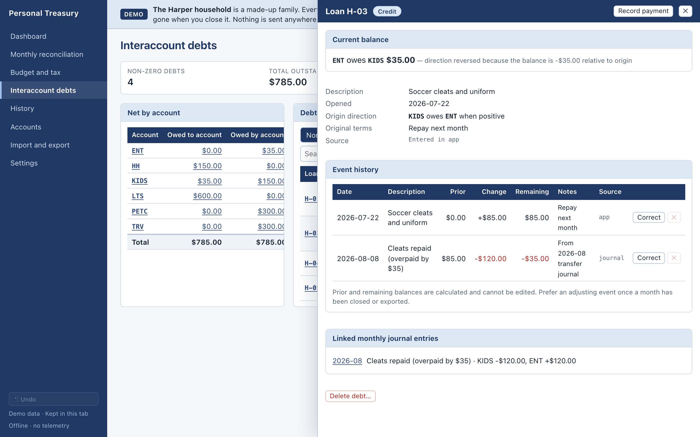
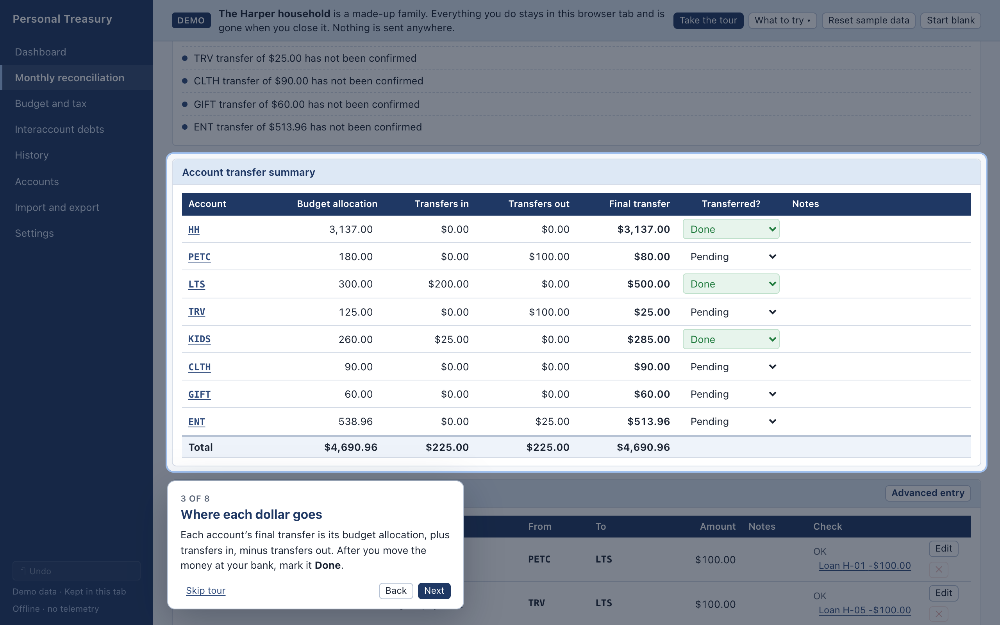
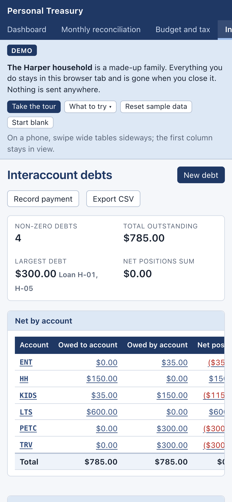
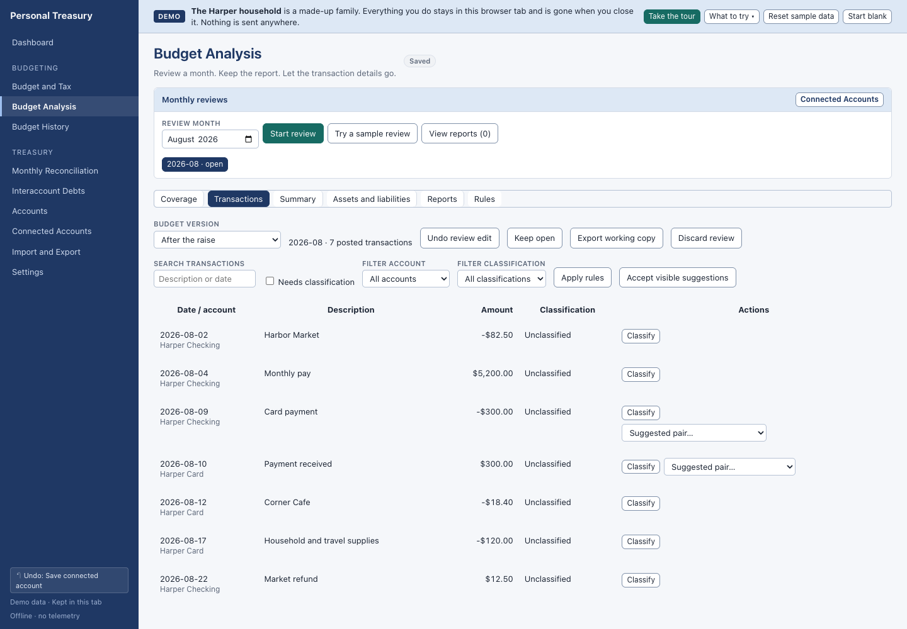
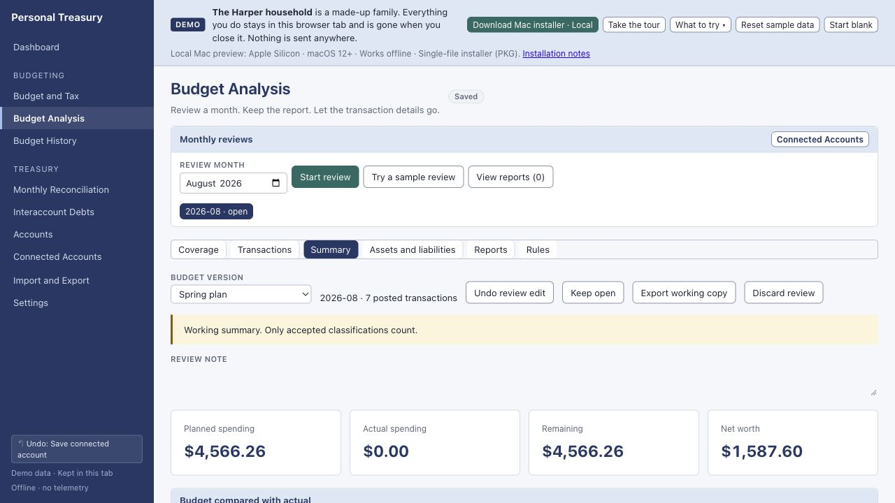

# Personal Treasury

By Orca Solutions.

A local-first desktop and private web app for running a household's money as a set of **virtual account buckets**: plan how each paycheck is split, record transfers between buckets, reconcile every month to the cent, and keep an event-sourced ledger of what the buckets owe each other.

**[Try the live demo →](https://pt.orcasolutions.dev/)** It runs entirely in your browser with sample data for a made-up family, starts with a one-minute guided tour, and includes a sample workbook to import. Nothing is sent anywhere, and your changes disappear when you close the tab.

**[Follow the one-minute walkthrough →](docs/guide/demo-walkthrough.md)** See how one paycheck becomes account allocations, monthly transfers, reconciliation and debt history.



## Download v3

**[Download Personal Treasury Local for Mac (.pkg)](https://github.com/jfricano/personal-treasury/releases/download/v0.3.0-preview.2/Personal-Treasury_0.3.0-preview.2_Apple-Silicon_Local.pkg)** · [Release notes, alternate DMG and checksums](https://github.com/jfricano/personal-treasury/releases/tag/v0.3.0-preview.2)

Current public version: **0.3.0-preview.2**, for Apple Silicon Macs running macOS 12 or later. The single-file installer places **Personal Treasury Local.app** in Applications. Local works offline, starts empty and stores records on your Mac. **Local is the only public download.** Connected builds are configured privately for a specific service and are not distributed through this repository's releases or demo.

The PKG is unsigned and its app is ad-hoc signed without Apple notarization. If macOS blocks it, click **Done**, then **System Settings → Privacy & Security → Security → Open Anyway** and confirm. The installed app may need the same approval on first launch. See [installation instructions](docs/guide/getting-started.md#2-install-the-local-mac-app).

## New in v3

- **Budget Analysis:** import CSV, OFX, QFX or QBO statements, classify and split spending, pair internal transfers, then compare actuals with the budget.
- **Assets and liabilities:** capture real-account balances alongside the spending review, separate from virtual bucket allocations and interaccount debts.
- **Cleared monthly reports:** retain aggregate results and export them to Excel; raw transactions stay temporary and are discarded after clearing or expiry.
- **Private access:** an independently hosted private service uses User ID, password and MFA, encrypted working copies, guarded sync and separately encrypted backups. Existing v2 history has a one-time desktop migration.

V3 is available on `main`, in the public demo and as a **GitHub prerelease**. Provider lifecycle, independent security review and remaining packaged Mac/Safari/iOS acceptance checks are still outstanding. See the [v3 release notes](docs/release-notes-v0.3.0.md) and [release status](docs/development/v3/preview-status.md).

## What it does

- **Budget → treasury.** A budget version turns gross pay, payroll deductions and actual withholding into take-home pay, then funds each account bucket from explicit budget lines. Versions lock once used, so history stays intact.
- **Monthly reconciliation.** Each month starts from the active budget. Transfers between buckets are journal entries, and every account's final transfer is `budget allocation + transfers in − transfers out`. The month is **Review**, **Ready to transfer** or **Complete**, and every failing check is named.
- **Interaccount debts.** When one bucket borrows from another, each Loan ID is a chronological event history. Balances are always recalculated, never typed in. The summary shows the latest non-zero balance per loan and reverses who-owes-whom when a loan is overpaid.
- **Tax estimate.** Federal, California, Social Security and Medicare estimates from editable, per-year rule tables, compared with what's actually withheld. It never changes take-home pay.
- **Actual spending and real balances.** Budget Analysis checks statement coverage, classifications and transfer pairs before retaining a monthly report. Reports include planned-versus-actual totals, year-to-date figures and a balance snapshot.
- **Excel in, Excel out.** Imports the spreadsheets it replaces, with a preview, control totals and cell-level warnings. It exports a normalized workbook and a complete JSON backup.
- **Traceable and reversible.** Treasury summaries link to their contributing entries. Persistent treasury edits are audited and support session undo; temporary reviews have separate undo, and cleared transaction details are not recoverable through it.

## Screenshots

<table>
  <tr>
    <td width="50%"></td>
    <td width="50%"></td>
  </tr>
  <tr>
    <td>Dashboard: expected cash, reconciliation, transfers and debts at a glance.</td>
    <td>A loan's full event history. Overpaying it reversed who owes whom.</td>
  </tr>
  <tr>
    <td></td>
    <td align="center"></td>
  </tr>
  <tr>
    <td>The guided tour walks through each screen on a first visit.</td>
    <td>On a phone, wide tables scroll inside their panels.</td>
  </tr>
  <tr>
    <td></td>
    <td></td>
  </tr>
  <tr>
    <td>Classify statement activity and pair transfers in Budget Analysis.</td>
    <td>Compare spending with the plan before clearing the monthly report.</td>
  </tr>
</table>

## Privacy

Local keeps its SQLite profiles and temporary reviews on your Mac, with no sign-in or cloud connection. A privately configured Connected app and private website keep encrypted local working copies and sync client-encrypted snapshots and review objects through their private service. Provider credentials live in a separate encrypted vault and are used only by the signed-in native app. The public demo uses fictional tab-scoped data, excludes the live provider adapter and does not sync. No telemetry or remote logging is included. Money is stored as exact decimal strings and calculated with `decimal.js`. Normal backups and cleared reports exclude raw review transactions and provider credentials. See the [user guide](docs/guide/user-guide.md) for sync, retention and recovery.

## Build from source

Use Node.js 24 or newer. For an existing Mac installer, use the download above.

```bash
npm ci
npm run dev:demo      # the demo with sample data at http://localhost:1420
env -u PT_SERVICE_ORIGIN npm run desktop:installer # Local Mac PKG; needs Rust/Apple Silicon
npm run build:private # private web build for the snapshot service
```

Or run the demo container: `docker run --rm -p 8080:8080 ghcr.io/jfricano/personal-treasury-demo`, then open http://localhost:8080.

[Getting started](docs/guide/getting-started.md) walks through running, building and setting up your household.

## Documentation

- **Using it:** The [user guide](docs/guide/user-guide.md) covers v3, from setup and monthly cash allocation to spending reviews, debts, private access and backups. See [Getting started](docs/guide/getting-started.md) for installation, or [Railway hosting](docs/guide/railway-sync.md) for a private service. The v2 guides are historical.
- **What's new:** [v3 release notes](docs/release-notes-v0.3.0.md) cover the current preview; the [release report](docs/development/v3-release-report.md) records publication, validation and remaining work.
- **Sharing it:** [Distribution plan](docs/distribution-plan.md) and the [demo walkthrough](docs/guide/demo-walkthrough.md).
- **Building it:** [Development](docs/development/development.md), [architecture](docs/development/architecture.md), the [calculation rules](docs/development/data-and-rules.md), [workbook import](docs/development/workbook-import.md), [acceptance tests](docs/development/acceptance-tests.md), [testing](docs/development/testing.md) and [decisions](docs/development/decisions/).

[docs/README.md](docs/README.md) lists every document and what it's for.

Stack: Tauri 2, React 19, TypeScript, SQLite (sql.js), decimal.js, Zod, SheetJS, Vitest and Playwright. The app replaces a spreadsheet system and preserves its rules exactly. The owner's own workbooks, and the tests that check the app against them, stay private (see [reference/README.md](reference/README.md)); the public tests use synthetic workbooks and the demo's fictional household.

## License

[MIT](LICENSE)
