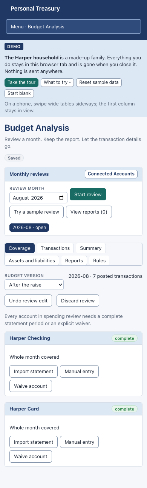

# v3 implementation preview — 0.3.0-preview.1

[Draft implementation PR #7](https://github.com/jfricano/personal-treasury/pull/7) incorporates the design in PR #6. This is a runnable review build, **not a production release candidate**. The public Pages deployment is unchanged. Do not migrate the live private service onto this preview.

## Try it locally

```sh
npm ci
npm run build:demo
npm run preview:demo -- --host 127.0.0.1 --port 1430
```

Open <http://127.0.0.1:1430/#/analysis>, choose **Try a sample review**, pair the two card-payment rows, and classify the other five transactions. Try splitting Household and travel supplies between budget lines. Review Coverage, Summary, and Assets and liabilities. Clear the month to retain its aggregate report and delete its transaction details. Export the report to Excel; Undo removes the report without recovering deleted transaction details.

The sample uses the fictional Harper household. Data stays in the browser tab and is discarded when it closes; Reset sample data / Start blank also discard temporary reviews. Statement connections accept CSV and OFX/QFX/QBO files after a preview. CSV imports require explicit columns, sign convention, and statement period. The demo build excludes the live Plaid adapter; a build check enforces that boundary.

To experience private sign-in with disposable fictional data:

```sh
npm run preview:private:fixture
```

Open <http://localhost:8788>. The command prints a fictional user ID, password, and one-use recovery code, and writes them to the gitignored `test-results/v3-access.json`. Choose Recovery code as the second factor. Reload to experience password unlock. Settings includes passkey enrollment, recovery-code regeneration, authenticator replacement, device/session revocation, encrypted backups, history and locking. Sensitive changes require fresh authentication; the fixture also supplies an authenticator secret for that step. Desktop password changes and provider access require the native application.

The fixture generates fresh secrets and a temporary data directory on each run. It is a localhost test fixture, not a deployment configuration. Use the demo for the shortest sample-review walkthrough; use the private fixture to inspect authentication and encrypted persistence.




## Implemented paths

- Grouped responsive navigation, first-visit introduction, guided tour, dashboard review status, Budget Analysis and Connected Accounts.
- Exact decimal normalization; explicit statement coverage and waivers; classifications, splits, configurable categorization rules, optional remembered classifications, duplicates, reciprocal transfer pairs and clear blockers.
- Household time zone, settlement-window and transfer-pairing defaults in Settings. New reviews capture these preferences; existing reviews and reports retain their original settings. Provider freshness is evaluated in the review's household calendar.
- Separate ephemeral review storage with local undo, three-review limit, 14-day idle / 45-day maximum retention, encrypted local writes, debounced cloud writes and explicit Keep device / Use cloud / Keep both conflict choices. Cloud deletion takes precedence; failed clears retain an awaiting-upload review until report persistence and deletion are acknowledged.
- Schema 5 stores connection metadata, categorization rules and report headers/lines/flows/sources/balances in explicit columns, with separate source-window rows. It upgrades schema-3 backups and schema-4 previews in place. Stable budget-line keys preserve identity across edits. Review transactions remain outside SQLite, audit snapshots and normal backups.
- Working and cleared summaries, planned-versus-actual spending, categories and funding roles, line-level year-to-date totals, source windows, balance estimates, capture/source metadata and aggregate XLSX export. A separately warned working export includes transaction details.
- Re-review notices compare the preceding cleared month's final seven days by aggregate count and sum when a fresh complete window is available. This does not detect changes earlier in that month or equal-count/equal-sum substitutions; retained reports intentionally contain no raw transactions.
- Optional monthly liability details, including statement balance, minimum payment, APR, due date and principal. These are review-specific manual entries; persistent institution-level defaults remain follow-up work.
- Private Argon2id/HKDF/AES-GCM encryption; password plus TOTP/recovery/passkey sign-in; bounded common-password blocklist; cookie and native device sessions; fresh step-up; recovery-code regeneration; staged authenticator replacement; credential/session revocation; desktop password change; server idle/absolute expiry; CSRF controls and conditional snapshot writes.
- Encrypted local databases/safety copies, review objects, provider vault and separately encrypted backups. Native offline unlock uses an origin/account-bound encrypted-key cache and requires an existing local database. Online-only actions are gated while offline.
- Signed desktop proof selects the trusted-device lockout pool. Operational MFA reset is single-use, password-bound and followed by new authenticator enrollment. Server at-rest key rotation rewraps account secrets atomically while preserving client ciphertext.
- Enforced restrictive CSP and Trusted Types, an allowlisted crypto-worker policy, sanitized request logs and daily security-event files with retention. No provider tokens, raw transaction bodies or untrusted request paths are logged.
- Desktop-first legacy-history migration with write freeze, per-version decrypt/re-encrypt/readback and explicit cutover; legacy ciphertext remains preserved after commit.
- Native allowlisted Plaid HTTPS transport, lossless decimals, pending Hosted Link recovery, selected-institution verification, durable conservative Trial accounting, encrypted vault retry, persistent rate/backoff state, complete-window removals/corrections and available liability metadata. **No live or Sandbox provider lifecycle has been validated.**
- macOS sleep/screen-lock integration and desktop zoom shortcuts compile. Their packaged-app acceptance checks remain outstanding.
- Pinned container bases and GitHub Actions, disabled dependency install scripts, a seven-day dependency cooldown, isolated private-service dependencies and a non-root immutable runtime with Node filesystem permissions and no package manager.

## Validation recorded

The continuation was checked on September 30, 2026:

- 148 unit/integration tests, including schema-3/4 migration, backup round trips, aggregate-only persistence canaries, review conflict/deletion races, provider vault retries and household-calendar coverage.
- 25 Node service tests, including MFA, step-up, credential revocation, password changes, trusted-device proof, break-glass recovery, at-rest rotation, sanitized logs, CAS writes, tombstones and migration cutover.
- 30 demo browser tests across existing features and v3, including sample review → clear → export, working-export warnings, liability fields and responsive checks at 390, 768, 1280 and 1440 pixels.
- Private Chrome flow: password plus recovery code, virtual passkey, encrypted reload/unlock, strict CSP/Trusted Types, and two-browser review conflict resolution. Two legacy private browser regressions cover snapshot sync and inactivity logout.
- Two Rust tests cover provider allowlisting and persisted rate/backoff state; macOS native compilation passes.
- Hardened private container smoke test: non-root/immutable runtime, Node permissions, absence of npm/npx, synthetic encrypted history surviving restart, MFA, unauthenticated rejection and sanitized logs.
- 69 owner-local regression tests passed using ignored private fixtures. No fixture or owner-specific reference file is published.
- Format, lint, TypeScript and all three web builds; documentation file-link check; production audits with no reported vulnerabilities; dependency signature checks; owner-local privacy scan.

These are targeted automated checks, not a claim that every V3-AT/SEC requirement has passed. See the test files for exact assertions. CI repeats web checks and the container smoke test on the PR.

## Remaining release work

1. **Provider validation:** exercise real Plaid Sandbox Hosted Link, pagination, institution selection, reconnect/remove, exchange/write failure recovery, provider corrections and Trial accounting. Do not spend Production slots for a preview test.
2. **Native and browser acceptance:** packaged Mac first enrollment, offline unlock/reconnect, password change, zoom, sleep/screen-lock and key lifetime; Safari/iOS passkeys, keyboard and VoiceOver. Test offline expiry/restart/conflicts across actual devices.
3. **Independent security and operational review:** map the full SEC matrix to evidence, review crypto/key lifetimes and crash recovery, and resolve remaining specification differences before declaring a release candidate. CSP report collection, exact lockout-delay behavior, hashed-asset cache policy and power-loss durability need explicit review; current atomic file replacement does not claim fsync durability.
4. **Product acceptance:** owner walkthrough of a completed real month, aggregate reconciliation and reports. Remaining specification follow-ups include institution-level liability defaults, transfer confirmation hints, complete figure drilldowns, and closed/removed-account metadata refinements. Do not mark these complete based on the sample alone.
5. **Release operations:** final custom domain before registering production passkeys, TLS/security-header verification at the actual edge, staging migration/backup/restore/key-rotation/break-glass rehearsal, signed installer and owner-approved rollout.

No deployment, release tag, real-account connection or live-data migration is part of this PR deliverable.

## Private service development configuration

Use one service process with a persistent data directory. The v3 service requires `PT_PUBLIC_ORIGIN` and four independent 32-byte base64 values: `PT_AUTH_PEPPER`, `PT_AT_REST_KEY`, `PT_DEVICE_COOKIE_KEY`, `PT_LOG_KEY`. Use `PT_SETUP_SECRET` for initial enrollment; migration from an existing v2 service also requires its existing `PT_SYNC_TOKEN`. Back up server secrets separately from ciphertext. The service cannot recover a forgotten encryption password.

`PT_SYNC_DATA_DIR`, `PT_STATIC_DIR`, `PT_SYNC_HOST` and `PT_SYNC_PORT` select data, assets, interface and port. Startup without `PT_AUTH_PEPPER` retains the legacy service protocol for regression testing; the v3 private UI requires v3. The separate `private-legacy` Vite mode exists only for legacy browser regressions. The private image runs as UID 1000; give bind-mounted data that ownership. A newly created named Docker volume inherits the image directory ownership.

Leave `PT_TRUST_PROXY` unset for direct connections. Set it to `1` only behind a trusted edge that overwrites `X-Real-IP`; client-supplied forwarded headers must not reach the service unchanged. `X-Forwarded-For` does not select a lockout bucket.

For operational MFA recovery, configure a fresh random `PT_AUTH_MFA_RESET` value of at least 32 characters and restart. Its hash is consumed before enrollment begins. The owner must still prove the encryption password, enroll a new authenticator and save new recovery codes. Old factors and sessions are revoked on confirmation. If the process dies after consumption, the operator must issue a different reset value; replaying the old value cannot reopen recovery.

For at-rest rotation, retain `PT_AT_REST_KEY_1` with the old value, add independent `PT_AT_REST_KEY_2`, and set `PT_AT_REST_KEY_ID=2`. Startup reads the old key and rewrites protected server secrets using key 2. Verify restart and sign-in before removing the old key from the running configuration. Preserve old keys with backups that still depend on them. A named active key takes precedence over the legacy `PT_AT_REST_KEY` fallback; a missing required historical key fails startup.

For a development desktop against a disposable HTTPS service:

```sh
PT_SERVICE_ORIGIN=https://your-development-service.example npm run tauri:dev
```

The wrapper names builds **Personal Treasury Local** when `PT_SERVICE_ORIGIN` is absent, and **Personal Treasury Connected** when it is set. Development names also end in **Dev** and use separate identifiers. `npm run desktop:build` produces the corresponding named app and installer; it narrows CSP to the configured service origin. Connected retains `com.personaltreasury.app` so existing encrypted data and device keys remain accessible. Local uses `com.personaltreasury.app.local` and its own data folder. Only the native adapter contacts Plaid.

Reproduce the hardened container smoke test with `node scripts/smoke-private-container.mjs` and a running Docker engine. It creates and removes only its own disposable fictional container and volume. Node's permission model restricts accidental filesystem access; it is not an isolation guarantee against malicious runtime code.

## Password-blocklist provenance

The bounded blocklist includes 1,024 distinct normalized passwords of 15–256 code points from the [SecLists common-password corpus at the pinned commit](https://github.com/danielmiessler/SecLists/blob/e749176aa4e3261ff41f7d197d7a01a0a705030e/Passwords/Common-Credentials/xato-net-10-million-passwords-1000000.txt), plus application-context patterns. Only SHA-256 hashes are shipped. The [MIT notice](../../../src/security/blockedPasswords.LICENSE.txt) accompanies the derived hashes. Rebuild with `node scripts/build-password-blocklist.mjs /path/to/the/pinned/corpus.txt`; the generator applies the same NFKC/case normalization as validation. This is a bounded common-password check, not a comprehensive breach lookup.
