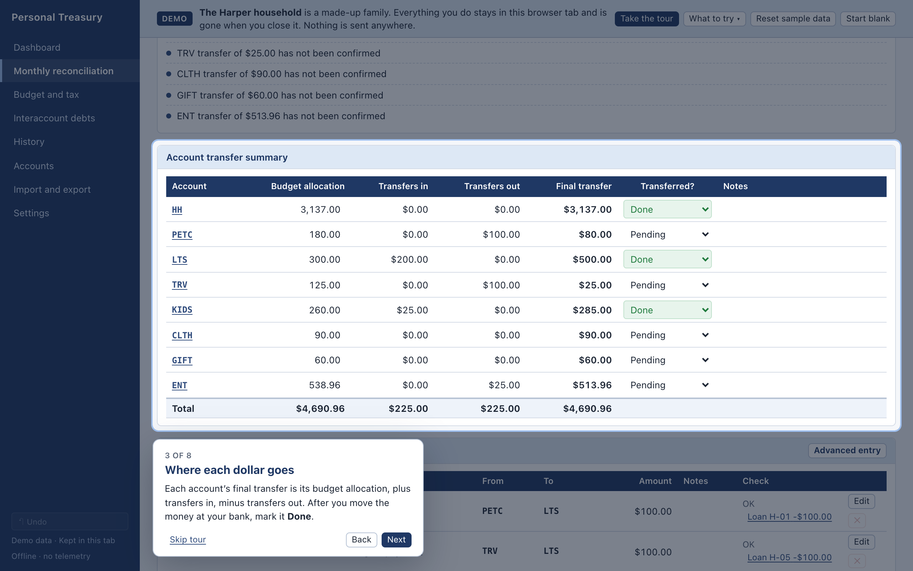
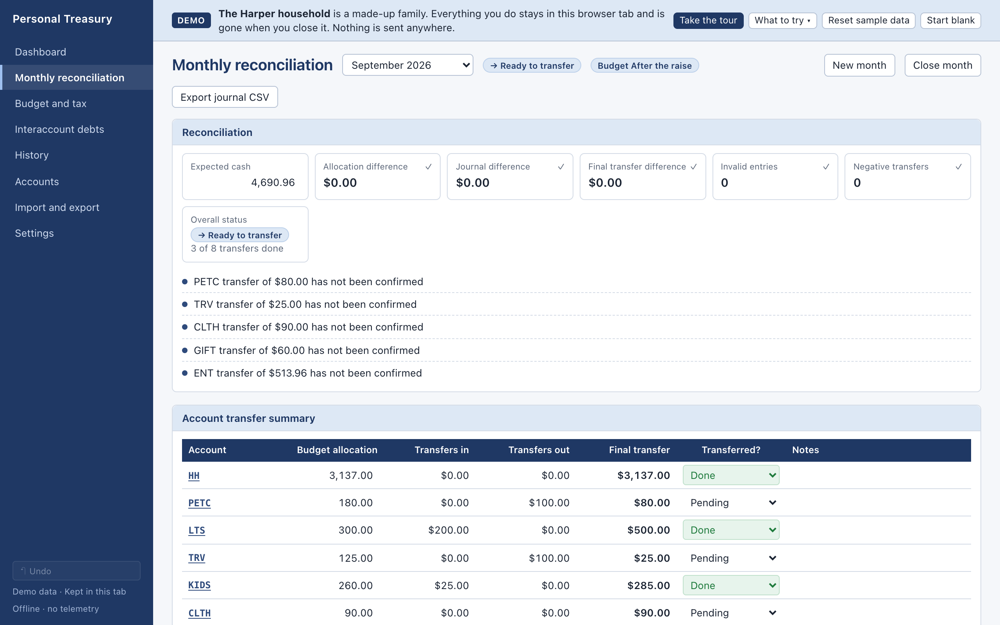
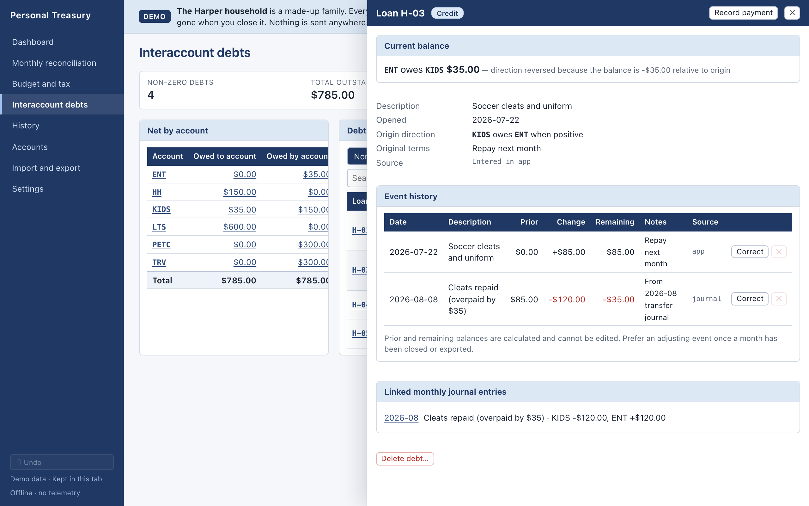

# Personal Treasury — User Guide

Personal Treasury replaces a spreadsheet system of two workbooks: a cash-flow and account ledger (monthly transfers and interaccount debts) and a personal budget (pay, budget and tax). The desktop app stores everything on your Mac, works offline, and recalculates every total from the underlying entries.

## Try it in the browser

The [live demo](https://jfricano.github.io/personal-treasury/) runs the same app with sample data for **the Harper household**, a made-up family: Sam, Riley (9) and Biscuit the beagle, one paycheck and eight treasury accounts. It runs entirely in your browser. Your changes stay in that tab and are gone when you close it.

- A one-minute **guided tour** starts on your first visit and walks through each screen. **Take the tour** in the banner runs it again.
- **Reset sample data** puts the Harpers back. **Start blank** gives you an empty database, as on a first launch. Both can be undone with ⌘Z / Ctrl-Z.
- **What to try** lists short exercises, one per feature. The examples in this guide use the Harpers too.
- To try an import, download either sample workbook beside its import button on **Import and export**, then choose **Start blank** and import it.

## First launch: import your workbooks

Import the treasury workbook first, then the budget workbook. Both imports are on **Import and export**. If you're starting fresh instead, create accounts on **Accounts** and a budget on **Budget and tax**.

### Treasury workbook

1. Choose **Import workbook** (or open **Import and export**) and pick your cash-flow workbook. The file is only read, never changed.
2. Review the preview:
   - **Controls** compares what the workbook displays with what the app recalculates: the non-zero debt count, total outstanding, largest debt, every account's net position, and each month's reconciliation.
   - **Warnings** list each questionable source cell with its sheet and cell reference. For example: blank debt changes imported as $0, unusual confirmation markers, unbalanced legacy rows, and unknown codes such as `???` preserved for review.
3. Choose **Commit import**. If anything fails, nothing is saved. You can save the report as Markdown or JSON.

Historical months are imported as closed. The most recent month stays open. Imported months are **archival**: they record what happened and aren't linked to any budget.

### Budget workbook

1. Under **Import budget workbook**, choose your budget workbook. It's only read.
2. The preview lists the current plan and its control comparisons. The older Personal Budget layout can also bring in summary-only history. A budget workbook exported by this app contains only the current plan: Summary, a sheet for every category, and Payroll and tax.
3. Leave **Make the workbook's current plan the active budget** ticked and choose **Commit budget import**. Treasury months, transfers and debts aren't changed.

## Budget and tax

Open **Budget and tax**. Budgets plan how take-home pay is funded into your accounts. They never create transfers.

### Budget History

- **Budget History** in the sidebar lists every version: its status (Active, Draft, Archived; Locked once a treasury month uses it), the months it was in effect, which treasury months used it, and take-home pay. The Harpers have an archived **Spring plan** and the active **After the raise**.
- Summary-only versions imported from an old Budget History sheet show the figures recorded there. They're read-only.
- **To change your budget**, choose **Duplicate** on the current version. Edit the draft, then **Activate…** and pick the month it takes effect. The previous version is archived, with its end date set to the month before. Locked and archived versions can't change amounts, so history stays intact.
- You can delete a draft or an archived version that no treasury month uses. Active and used versions stay linked to their months.

### Pay and payroll deductions

- **Gross pay** and each deduction are monthly. Enter deductions as positive amounts; an employer credit is negative. A deduction can be a formula, rate × (gross − exclusion): the Harpers' 401(k) is 5% × (gross − $0), and both numbers are editable.
- The **Fed / CA / FICA** ticks record which wage bases a pretax deduction reduces. Health, dental and vision premiums usually reduce all three. Retirement deferrals such as a 401(k) reduce federal and California income but still count for Social Security and Medicare.
- **Actual withholding** (federal, California, Social Security, Medicare) comes from your pay stub. Take-home pay = gross − deductions − actual withholding. The tax estimate never replaces these numbers.

### Planned allocations

- Each line has a **category** (what it's for) and a **Funded by** account (where the money comes from). The Harpers' clothing is funded by **Clothing**; most household, transportation and lifestyle items are funded by **Household**.
- **Pets etc.** holds recurring but non-regular charges: Biscuit's food and vet bills, medical and dental copays, and car maintenance.
- **Discretionary** is the remainder (take-home minus every other line), funded by **Entertainment**.
- **Funding by treasury account** shows what each account receives. New treasury months use these totals.

### Tax estimate and tax rules

- The **Tax estimate** panel compares estimated annual federal, California, Social Security and Medicare tax with what's being withheld. For the Harpers' current plan it shows a **projected underpayment of $258.52** (federal $124, California $134, Social Security and Medicare $0.52).
- A yellow note shows when rates come from another year. For example: *California income tax: using 2025 rates for 2026 (provisional)*.
- **Tax rules** holds the figures for each tax year. **Copy** a year to start the next one (marked provisional). Then edit brackets, standard deductions, the California exemption credit, Social Security and Medicare rates, the wage base, and "rates from year". **Save** each section. A version's **Tax year for estimate** picks which year it uses.
- The estimate models a single filer. It's a planning aid, not tax advice.

## The monthly workflow

Open **Monthly reconciliation**.

1. **Start the month.** Choose **New month**. The app proposes the next calendar month and starts from the **active budget**:
   - Expected cash is the budget's take-home pay.
   - Each account gets the budget lines it funds.
   - The month shows a badge naming the budget version, such as **Budget After the raise**. Click it to open that version.

   These are planned amounts only; no transfers are created. You can also duplicate a prior month or start blank. The app never adjusts allocations to make them tie. A difference shows as a red check.

   - **Changing an allocation or expected cash by hand** makes it an **override**, marked with a badge. It's never written back to the budget.
   - **If the budget changes while the month is open**, an amber banner lists the differences. **Review and refresh…** previews every account and applies the budget only when you confirm. Overrides are kept unless you tick **Also replace my manual overrides**. A line already marked Done whose amount changes returns to Pending.
   - When only your overrides differ, a small note lists them instead of the banner.
   - Closed months are never refreshed, and archival imported months aren't linked to budgets.
2. **Record transfers**, one row per transfer, in the entry row at the bottom of the Transfer journal:
   - Date → Loan ID (optional) → Description → From → To → Amount → Notes, then press **Enter**. The row saves and a fresh row opens.
   - Type account names directly, such as **Household** or **Pets etc.** Amounts must be positive: From decreases, To increases.
   - **Escape** clears the row. Invalid rows (missing account, same account, zero or negative amount) are rejected with the reason.
   - If the row's Loan ID matches a debt and money moves between that debt's two accounts, a **Record on Loan …** button shows the exact change. Click it to post the payment to the debt ledger. It can't be recorded twice.
   - **Advanced entry** opens a multi-posting editor. Imported legacy rows with more than two postings show a ▸ control that expands their postings.
3. **Reconcile.** The Reconciliation panel shows allocation difference, journal difference, final-transfer difference, invalid entries, negative transfers, and overall status. Every failing check is listed by name, for example “Final transfer for Travel is negative”.
   - **Review**: something needs fixing.
   - **Ready to transfer**: all checks pass, but some transfers haven't been made.
   - **Complete**: every non-zero final transfer is marked Done. Zero lines are “Not required”.
4. **Make the bank transfers** and set each account's **Transferred?** to Done, here or on the Dashboard.
5. **Close month.** A closed month is read-only until you choose **Reopen**. Closing a month in Review asks for a reason and records it.

Click an account name in the transfer summary to filter the journal to that account. **Past months** near the bottom of Monthly reconciliation lists earlier reconciliations. Cmd-Z undoes the last change in this session. Editable cells outlined in amber have unsaved edits: Enter saves, Escape reverts.

## Interaccount debts

The debt screen shows only the **latest balance per Loan ID**, and only balances of at least $0.01.

- **Net by account**: click any amount to list the debts behind it.
- **Debt detail**: filter by Non-zero, All, Open, Paid, Credit or Review note, and by account, text or date. Notes containing “canceled” are highlighted but still count. Only a zero balance removes a debt. (The Harpers' H-04 school trip deposit is an example.)
- Click a Loan ID to open its drawer. The drawer shows origin metadata, the current direction, and the full event history with calculated prior and remaining balances, plus source cells and linked monthly entries.

### Record a payment

Use **Record payment** (at the top of the page or in the drawer), enter the date and a **positive** payment amount, and check the preview:

- The change that will be stored (negative relative to the origin direction while the debt is positive).
- The resulting balance. “This pays the debt off” means it will leave the summary.
- For an overpayment, a red note shows the reversed direction. Paying $400 on the Harpers' H-05 (Travel owes Long-term savings $300) shows *Long-term savings owes Travel $100.00*.

Tick **Advanced: signed adjustment** to enter a signed change directly. Positive changes increase what the origin debtor owes.

### Create a debt

Choose **New debt**, then enter the Loan ID (unique; hyphens are fine), opened date, description, debtor account (who owes), creditor account (who is owed), a positive opening amount, and optional terms. The dialog confirms “Household owes Long-term savings $250.00” before you save. For more activity on an existing Loan ID, record a payment or adjustment. Don't create a second debt.

### Correcting mistakes

- **Correct** on an event edits its date, change or note. The correction is audited.
- **✕** deletes an event. Imported events need confirmation, and Cmd-Z restores them.
- Once a month is closed or exported, an adjusting event is preferred over editing history.

## Accounts

- Add and rename accounts by name. Older workbook identifiers are kept internally so imported records still match their accounts.
- Reorder with the arrows, edit descriptions, and use **Active** to archive or restore accounts. Used accounts can't be deleted. Imported unknown accounts can be marked reviewed.
- Monthly allocations come from the budget (see **Budget and tax**). The old allocation template is kept for history only.

## Backups and exports (always your choice)

- **Excel workbooks**: one treasury workbook with Overview, Account Ledger, monthly sheets and supporting tables; one current-budget workbook with Summary, category sheets, and Payroll and tax. Each can be imported through its matching import button. If there is no active budget, only the treasury workbook is saved.
- **Complete JSON backup**: exact decimals and every record, including budget versions, payroll and tax rules. In the desktop app, restore it into a **new profile** (recommended) or replace the current one; in the demo, it replaces the demo data. A safety copy is saved first.
- **CSV**: the journal for the selected month, or debt events for the current debt filter.
- **Settings → Safety copies**: automatic copies taken before an import or restore replaces data.

Nothing leaves your computer unless you save a file somewhere yourself.
